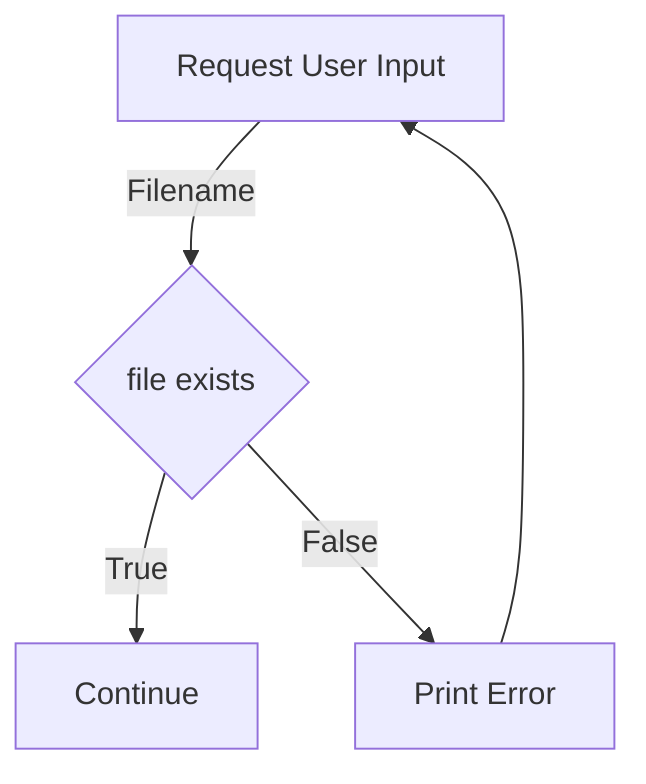
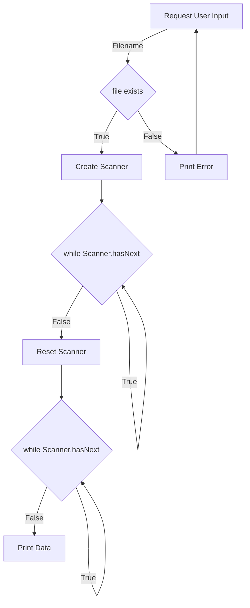

I am writing this to accompany the completion of this Homework assignment, and ensure understanding of the materials within - largely because it seemed as though you were asking about the assignment in general. This will assume a zero-sum of knowledge for the purposes of explanation, but know that I don't think you stupid or anything, I just want to ensure clarity from the base upwards. 

# Understanding The Problem

For any program we write, we need to understand what we're actually doing. Luckily the problem statement is clearly outlined for us! Let's look at that. 

> Design and implement a Java program that processes examination scores from a data file. The program will determine statistics about the examination such as letter grade counts, the average, and the standard deviation of the population. The results should be printed to the console and saved to a new output file as well. A sample input file features numbers separated by a single white space, like so:

```
57 80 100 95 55 78 61 53 84 34 
69 74 70 74 71 87 26 83 83 79
37 74 85 67 38 82 72 38 74 16
81 81 80 92 82 86 64 56 69 41
81 80 71 59 71 81 77 68 88 67
58 43 75 96 72 81 42 62 75 85
```

So our goals are as follows:
- Read Input File
- Interpret Data
- Determine Statistical Data
  - Average
  - Standard Deviation
- Print
- Save Data to File

These are the things we actually need to *do* for this program to be considered functional. Of course, there's some additional requirements for functionality and adherence to the "technical specifications" of the project, but those are more minor. 

Specifically, those are:
- Display a welcome message
- Ask for the filename to read from
- Ensure scores read are valid
- Ensure printed data:
  - Contains the total exam count (minus bad data)
  - Contains the average score
  - Contains the population standard deviation
  - Contains the numbers and percentage of scores for each letter grade grouping
  - Min & Max score
- Ensure data is rounded to TWO decimal points (format prints)

It's also noted that we can, and *should* read the file twice to complete this task. 

What's important to note is that these "functional requirements" are actually just specifics of our goal. We can combine them. Pairing those up we get a new goal for our program:
- Welcome user
- Request valid input file (exists)
- Interpret all valid data (0 <= score <= 100)
- Determine Statistical Data
  - Average
  - Standard Deviation
  - Letter Grades of Students
  - Min & Max Scores
- Print Exam Count (number of valid scores)
- Print Average
- Print Standard Deviation (population)
- Print Letter Grade Data
- Print Min & Max Scores

Now that we've combined those requirements, they read significantly easier than reading the paragraph plus requirements. 

# Meeting the Requirements

Now that we know what we're doing, we need to actually *do* it. 

## Program Start
The first and foremost steps are the first two bullet items:
- Welcome user
- Request valid input file (exists)

We need to greet the user with some start message, and request a file of them. The first one is simple enough, we just need to print out some data to the user. Something like this should work:

```Java
System.out.println("Hello User!");
```

Of course we might make it fancier for the real deal. Assume all the class, main function, and package declaration junk is present above, I want to ignore it for now.

 But the file is a bit more complex. Specifically, it's composed of many sub-tasks. Let's take a moment to break those down first. If we want to request a file from the *user* that means the filename is input by them, so we need to gather user input. Next, we're checking if the filename they gave us is valid or not. This means we need to check for the existence of a file with that name. Here we have a decision to make. If the file exists, we can move to the next stage, but if it doesn't, we need to tell them and *repeat* what we originally did. That repitition tells us we'll need a loop. 

So this task look something like this:
- Ask user for filename
- Check if file exists
- If file exists -> Continue
- If file doesn't exist -> Restart
  
Which we can draw as so:



Asking a user for a filename is pretty easy, that's just a string. We can construct a scanner, print something to the user, and gather up whatever string they give to us!

```Java
Scanner inputScanner = new Scanner(System.in);  // Create a Scanner object
System.out.println("Enter Filename: ");

String fileName = inputScanner.nextLine();  // Read user input
```

We need to remember that this is on some sort of loop, so let's create that. We want the loop to continue as long as we still need a valid filename, so let's create a Boolean ```needValidFile``` to represent this for us. 

```Java
boolean needValidFile = true;
... // some other codes
while(needValidFile){
    Scanner inputScanner = new Scanner(System.in);  // Create a Scanner object
    System.out.println("Enter Filename: ");

    String fileName = inputScanner.nextLine();  // Read user input
}
```

This code will obviously repeat forever, because we never update the ```needValidFile``` variable, so we need to do that. We want to update it if the file is valid, and we can only check that after we've gotten the filename. 

To do so, we want to check whether the file exists. There's two decent ways to do that. We can find both by [Reading The Docs](https://docs.oracle.com/javase/8/docs/api/java/io/FileReader.html#:~:text=wait%2C%20wait-,Constructor%20Detail,-FileReader) for the ```FileReader``` class. Specifically, we want to read the constructors. 

### Solutions

There are two routes for solving this that the documentation reveals. The first is attempting to create a FileReader object using the user's string. The documentation says the following about this:


>```public FileReader(String fileName)```
           throws ```FileNotFoundException```,
Creates a new FileReader, given the name of the file to read from.

>Parameters:
```fileName``` - the name of the file to read from

>Throws: 
```FileNotFoundException``` - ***if the named file does not exist***, is a directory rather than a regular file, or for some other reason cannot be opened for reading.

This means if we want, we can use try-catch logic to handle this. We attempt to create a FileReader, if it succeeds we continue the program, and if we get an exception we print a message and retry!

```Java
boolean needValidFile = true;
FileReader scoreReader;

... // some other codes 

while(needValidFile){
    Scanner inputScanner = new Scanner(System.in);  // Create a Scanner object
    System.out.println("Enter Filename: ");

    String fileName = inputScanner.nextLine();  // Read user input

    try {
        scoreReader = new FileReader(filename);

        needValidFile = false; // Exception being thrown stops code, so this only runs if it succeeds
        // ^ If this runs the loop stops

    } catch(FileNotFoundException error){ // Handles the error
        System.out.println("The filename you input is invalid.");
    }
}
```

The second method reading the documentation reveals to us is using a ```File``` Object. The ```File``` Object shouldn't throw an error if given an invalid filename, but it does have an ["exists"](https://docs.oracle.com/javase/7/docs/api/java/io/File.html#exists%28%29:~:text=to%20the%20file-,exists,-public%C2%A0boolean%C2%A0exists) method we can use to check if a file exists or not. So, something like this would also work:

```Java
boolean needValidFile = true;

... // some other codes 

while(needValidFile){
    Scanner inputScanner = new Scanner(System.in);  // Create a Scanner object
    System.out.println("Enter Filename: ");

    String fileName = inputScanner.nextLine();  // Read user input
    File fileObj = new File(filename);

    if (File.exists()){
        FileReader scoreReader = new FileReader(fileObj);
        needValidFile = false;
    }
}

```

Beyond understanding these, another thing to make note of is the way file-path's work. There are two types of file-paths: Absolute and Relative. 

Absolute file-paths describe their exact location. They're technically still "relevant" to something, they're just relevant to the beginning of the system, so there's no alternative place they can lead. Examples:
- C:\Test\User\Examples\file.txt
- C:\Awesome\whyno.txt
- D:\HelloWorld\C\test.c

Relative paths describe where something is *relative to whatever is currently looking*. That means if you're on your desktop, it's telling you to look in the desktop, and if you're in the downloads folder it's telling you to look in the downloads. Examples include:
- interests.txt
- /movies/pirated/video13.mp4
- /files/image.jpg

These are relative because they're only part of the information needed to find them. Consider that all of the following are valid absolute paths:
- C:/Furries/Events/interests.txt
- C:/Minecraft/hacking/Tests/interests.txt
- D:/illegal/movies/pirated/video13.mp4
- C:/Pixar/movies/pirated/video13.mp4
- C:/tests/files/dontopenthis/new/old/movies/pirated/video13.mp4
- C:/files/image.jpg

A relative path is just directions on how to search. For Java, relative paths are relative to the project folder. This means if you use a name like "test.txt", Java will look for a file "test.txt" directly under the projects folder. This can be important to note, as having files in the wrong spot can be a source of error and issue. 

That all aside, we now have a program that welcomes a user, then asks the user for a valid file, and creates a ```FileReader``` for us when it's done. Let's get to the next step!!

## Program Data
Our next step is to use the ```FileReader``` to read and calculate the data from our input file!
- Interpret all valid data (0 <= score <= 100)
- Determine Statistical Data
  - Average
  - Standard Deviation
  - Letter Grades of Students
  - Min & Max Scores

Now that we have a ```FileReader``` to read numeric data from it, we can use a ```Scanner``` object where we've passed in the ```FileReader``` Object. We could technically also pass in a  ```File``` Object, and remove the need to create a ```FileReader```. 

We want to do this outside of and after our while loop, as we don't want to repeat it entirely. 
```Java
boolean needValidFile = true;
FileReader scoreReader;

... // some other codes 

while(needValidFile){
    ... // user input, initialized scoreReader to valid file
}

Scanner dataScanner = new Scanner(scoreReader);


... // All processing code


dataScanner.close(); // Always cleanup before quitting your program

```

Once we have the scanner, we need to go about actually collecting the data from the file. There's once again a few ways we can do this, but we'll just pick one. First, let's [Read The Docs](https://docs.oracle.com/javase%2F7%2Fdocs%2Fapi%2F%2F/java/util/Scanner.html#:~:text=int%20i%20%3D%20sc.nextInt()%3B) for the ```Scanner``` class. 

Some relevant documentation details are (use CTRL+F to find them):

>```Class - Scanner ```: A simple text scanner which can parse primitive types and strings using regular expressions.
A Scanner breaks its input into tokens using a delimiter pattern, which by default matches whitespace. The resulting tokens may then be converted into values of different types using the various next methods.

>```hasNext()```: Returns true if this scanner has another token in its input. This method may block while waiting for input to scan. The scanner does not advance past any input.

>```next(String pattern)```: 
Returns the next token if it matches the pattern constructed from the specified string.

>```nextInt()```: Scans the next token of the input as an int.

>```nextLine()```: 
Advances this scanner past the current line and returns the input that was skipped.

According to the documentation, the ```Scanner``` class *"breaks its input into tokens using a delimiter pattern, which by default matches whitespace"*. A delimeter is just a separator, and a token is just a fragment of a larger sentence (For example "red" is a token of "the red stop sign"). So what the documentation is *actually* saying is that the ```Scanner``` separates its input by spaces by default, and returns the next matching segment of data. 

So, if we took a string such as "Our user input is awesome" from ```System.in```, the tokens would be "Our", "user", "input", "is", and "awesome". Every time we called the Scanner class' ```.next()``` method, it would return the next token until no tokens existed. 

The ```nextInt()``` method is basically just the ```next()``` method that gets parsed to an ```Integer``` or ```int```, something like this:

```Java
public int nextInt(){ // not the real implementation
    return Integer.parseInt(this.next()); // "this" refers to the Scanner class
}
```

And the ```nextLine()``` method is basically just ```next()```, but with a newline character (\n) as the delimiter instead of a space. 

With that understood, it seems reasonable that we could just call nextInt in our loop to read all of the integer data. If you take a moment to recall how our input file should be formatted, there's spaces between all the data!

```
57 80 100 95 55 78 61 53 84 34 
69 74 70 74 71 87 26 83 83 79
37 74 85 67 38 82 72 38 74 16
81 81 80 92 82 86 64 56 69 41
81 80 71 59 71 81 77 68 88 67
58 43 75 96 72 81 42 62 75 85
```

So, with that in mind, what we want to do is point our scanner at our input data and, as long as there's more data to read, read that input data. 

```Java
... // some other codes 

Scanner dataScanner = new Scanner(scoreReader);
int nextScore = 0;

while (dataScanner.hasNext()){ // boolean function, checks for more data
    
    nextScore = dataScanner.nextInt(); // Read the next piece of data from the file
    ... // All processing code
}

dataScanner.close(); // Always cleanup before quitting your program

```

This loop will end when ```dataScanner.hasNext()``` is equal to ```false```, which will happen when it has read every single token it can find. We know from both the directions and our consideration of the goal that we'll need to do this twice, but we'll revisit that later. For now, let's calculate the average. 

An average is equal to the totality of the value of data points, distributed equally across the number of points. Basically, it's every score added together, divided by the number of scores. 

Our specification provides us the formula $avg = \dfrac{x_1 + x_2 + ... + x_n}{N}$, where each $x_n$ refers to a specific score, and $N$ refers to the total number of scores. Let's consider our sample data from earlier:

```
57 80 100 95 55 78 61 53 84 34 
69 74 70 74 71 87 26 83 83 79
37 74 85 67 38 82 72 38 74 16
81 81 80 92 82 86 64 56 69 41
81 80 71 59 71 81 77 68 88 67
58 43 75 96 72 81 42 62 75 85
```

Here, $x_1 = 57, x_2=80, x_6=78, \text{ and } x_{60}=85$ while the number of elements, or $N$, is 60. 

So, we understand what an average is, but how should we code it with a loop? To do so, let's manipuate our equation a bit. Rather than just the formula they gave us, we can use an equivalent but easier to program formula:

$avg = \dfrac{sum}{N}$, where $sum = x_1 + x_2 + ... + x_n$

The benefit of representing it like this is that it's very clear that the summation and division are completely separate. I'm going to manipulate this equation a little more with summation notation. 

$avg = \dfrac{sum}{N}$, where $sum = \displaystyle\sum_{n=1}^{N}x_n$

The benefit of summation notation is that, rather than representing one large summation equation, it represents a *process* of summation. A summation is equivalent to a loop with the same conditions, so the above sum is equivalent to the following code:

```Java
int sum = 0;

for (int n = 1; n <= N; n++){
    sum += x[n]; // x[n] refers to the n'th element of x, equivalent to x sub n
}

return sum;
```

We don't have a for-loop in our present code, however we *do* have a while loop. The while loop loops from the moment the `Scanner` Object is created, until it reads the last data point. So, if ```Scanner.hasNext()``` is *only* true while ```Scanner.next()``` is within the range of $x_1$ (start of the data) to $x_n$ (end of the data) then we know that our while loop is *actually* equivalent to our above for-loop. 

If our while-loop is equivalent to the above for-loop, and the above for-loop is equivalent to the above summation, then our while-loop is equivalent to the summation. So, let's convert that to code:

$sum = \displaystyle\sum_{n=1}^{N}x_n$

```Java
... // Other code

int data_sum = 0;

while (dataScanner.hasNext()){ // boolean function, checks for more data
    nextScore = dataScanner.nextInt(); // Read the next piece of data from the file

    data_sum += nextScore;   
}

... // Other code
```

At the end of that while loop, the variable data_sum will be equal to the variable sum, or $\displaystyle\sum_{n=1}^{N}x_n$. 

To finish that up, we just need to count how many data-points we encounter, and store that value in N. That will allow us to calculate the average. 

```Java
... // Other code

int data_sum = 0;
int N = 0;

while (dataScanner.hasNext()){ // boolean function, checks for more data
    nextScore = dataScanner.nextInt(); // Read the next piece of data from the file

    data_sum += nextScore;  
    N += 1; // we counted one more thing 
}

double average = data_sum/N; // calculate our average, use double for decimals

... // Other code
```

Beyond that, we need to recall that all the data we count should be valid, which means it has a value between 0 and 100. We can check that with an if-statement. 

```Java
... // Other code

while (dataScanner.hasNext()){ // boolean function, checks for more data
    nextScore = dataScanner.nextInt(); // Read the next piece of data from the file

    if (nextScore >= 0 && nextScore <= 100){ // greater-or-equal to zero AND less-or-equal to 100
        data_sum += nextScore; // summation  
        N += 1; // we counted one more thing 
    }
}

... // Other code
```

So now that we've calculated the average, we should calculate the population standard-deviation. 

The population standard-deviation is the average standard-deviation for the entirety of collected data, rather than a sample of it. Standard-deviation refers to the variance from the mean (or average) of a data-set, for each point in the data-set (or subset) considered. It's a good indicator of the spread of a data-set, and for something like test-scores, it can tell you whether high or low scores are outliers or the norm, and whether your data is consistent or erreneous. 

Luckily for you, understanding the calculation isn't always super important. As long as you can look at the equation and implement it, you can accept that your superior(s) decided it was a good idea and do it. 

The equation that they gave us was as follows:

$std = \sqrt{\dfrac{(avg-x_1)^2 + (avg-x_2)^2 + ... + (avg - x_n)^2}{N}}$

Let's convert that to summation notation..

$std = \sqrt{\dfrac{\displaystyle\sum_{n=1}^{N}(avg-x_n)^2}{N}}$

And let's break it into multiple separate equations..

$$deviation = \displaystyle\sum_{n=1}^{N}(avg-x_n)^2$$

$$distribution = \dfrac{deviation}{N}$$

$$std = \sqrt{distriution}$$

Now that looks a little bit more manageable. 

We already know that our while-loop is equal to that summation, and we already calculated the average, so let's just.. repeat our while-loop. To do this, we need to reset our `Scanner`. This is because `Scanner` keeps track of how much of a file it has read, and we already read the file once. 

```Java
... // some other codes 
Scanner dataScanner = new Scanner(scoreReader);
... // some other codes 

while (dataScanner.hasNext()){ // boolean function, checks for more data
    ... // Calculate Sum n stuff
}

double average = data_sum/N; // calculate our average

dataScanner.close(); // Always cleanup 
Scanner dataScanner = new Scanner(scoreReader); // create a new Scanner..

while (dataScanner.hasNext()){ // Repeat our loop..
    ... // Calculate Average
}
```

We reset our scanner by just creating a new one, and rather than engineer a way to do the loop twice, we can just duplicate it and change the contents. 

This time, instead of calculating the average we want to calculate the deviation. We calculated the average already, so we convert the equation as such:


$$deviation = \displaystyle\sum_{n=1}^{N}(avg-x_n)^2$$


```Java
... // some other codes 
double average = data_sum/N; // calculate our average

dataScanner.close(); // Always cleanup 
Scanner dataScanner = new Scanner(scoreReader); // create a new Scanner..

double deviation = 0;

while (dataScanner.hasNext()){ // Repeat our loop..
    nextScore = dataScanner.nextInt();
    
    deviation += Math.pow(average - nextScore, 2);
}
```

To calculate the deviation, we just subtract the number from the average, and use [Math.pow](https://docs.oracle.com/javase/8/docs/api/java/lang/Math.html#:~:text=pow(double%C2%A0a%2C%20double%C2%A0b)) from the Math library to raise it to the second power. 

Now onto the distribution. 

$$distribution = \dfrac{deviation}{N}$$

We can recalculate N, but we don't actually have a need to. 

```Java
... // some other codes 

double distribution = deviation/N;
```

And finally, we calculate the standard-deviation:

$$std = \sqrt{distriution}$$

```Java
... // other code

double std = Math.sqrt(distribution);
```

And with that, standard deviation is done!

We have two more ticket items left:
- Student Letter Grades
- Min & Max Scores

We'll modify the while-loop for our standard deviation to calculate these as well. 

The letter grades are relatively easy to calculate. We are assigned the following table
- 90–100 A
- 80–89 B
- 70–79 C
- 60–69 D
- Below 60 F

And we just need to track the number of students in those groups. We can start by keeping track of the numbers of students. 

```Java
... // Other code
int numWithA = 0;
int numWithB = 0;
int numWithC = 0;
int numWithD = 0;
int numWithF = 0;
... // Other code
```

And now we just need to add to these whenever a score meets the right condition. So, we have two decent ways to solve this. The first is to add a bunch of if-statements:

```Java
... // stuff for our math

while (dataScanner.hasNext()){ // Repeat our loop..
    nextScore = dataScanner.nextInt();
    
    deviation += Math.pow(average - nextScore, 2);
    // Extra calculations below here
    if (nextScore >= 90 && nextScore <= 100){ numWithA += 1;}
    else if (nextScore >= 80 && nextScore <= 89){ numWithB += 1;}
    else if /* ... Other statements*/
    else {numWithF += 1;} // Only runs if all above are true, which means score < 60
}

... // distribution, std, other stuff
```

Or we may recognize that our table is equivalent to one which rounds scores down to the lowest 10s place, and groups them together. So, we can make an equation such as:

```Java
int rounded = Math.round((nextScore-5)/10)*10;
```

And use a case-statement 

```Java
... // stuff for our math

int rounded = 0;

while (dataScanner.hasNext()){ // Repeat our loop..
    nextScore = dataScanner.nextInt();
    
    deviation += Math.pow(average - nextScore, 2);
    // Extra calculations below here
    rounded = Math.round((nextScore-5)/10)*10;

    switch(rounded){
        case 100:
        case 90:
            numWithA += 1; break;
        case 80:
            numWithB += 1; break;
        case 70:
            numWithC += 1; break;
        case 60:
            numWithD += 1; break;
        default: // All cases that aren't in the above..
            numWithF += 1; break;
    }
}

... // distribution, std, other stuff
```

Regardless of which method we choose to use, the result remains the same. Once we've calculated that, tracking the minimum and maximum scores are easy. We create variables for them, initialize them to the furthest value they can have, and for any score that meets the condition of being higher or lower, we update them.


```Java
... // stuff for our math
int max_score = 0;
int min_score = 100;

while (dataScanner.hasNext()){ // Repeat our loop..
    nextScore = dataScanner.nextInt();

    if (nextScore > max_score){max_score = nextScore;}
    if (nextScore < min_score){min_score = nextScore;}
    
    deviation += Math.pow(average - nextScore, 2);
    // Extra calculations below here
    
    {...} // Letter Grade Calculations
}

... // distribution, std, other stuff
```

Once we do all of *that* now we just need to print it out! So, we're done with this section. 

### Output

Printing all of this is easy, we have all the data now. Let's check our requirements:
- Print Exam Count (number of valid scores)
- Print Average
- Print Standard Deviation (population)
- Print Letter Grade Data
- Print Min & Max Scores

Let's implement it! The documentation for this is actually a little complex just because of how input and output is actually handled and wrapped for Java, so I'll summize it here. We can use ```System.out.printf``` to print formatted text (print-f). The way we do so is by passing in a string with patterns Java recognizes, alongside the data to fill those patterns in. The relevant pattern for numbers is `%d`, for decimal/float types it's `%f`, for strings it's `%s`. We can specify precision with a point, so `%.3f` means a float with 3 decimals of precision. Links below:

https://alvinalexander.com/programming/printf-format-cheat-sheet/

https://www.digitalocean.com/community/tutorials/java-printf-method

We provide the data by separating with commas in the same order as the format specifiers. You should have notes on this somewhere under course-materials. We also must remember to add a newline character, `\n`, so that there's a newline between every line. 

```Java
... // Calculations

System.out.printf("Number of exams: %d\n", N);
System.out.printf("Average Score: %.2f\n", average);
System.out.printf("Standard Deviation Score: %.2f\n", std);

System.out.printf("Students with letter-grade A: %d\n", numWithA);
System.out.printf("Students with letter-grade B: %d\n", numWithB);
System.out.printf("Students with letter-grade C: %d\n", numWithC);
System.out.printf("Students with letter-grade D: %d\n", numWithD);
System.out.printf("Students with letter-grade F: %d\n", numWithF);

System.out.printf("Max Score: %d\n", max_score);
System.out.printf("Min Score: %d\n", min_score);

```

And with that, our program can be considered complete!! Our program looks something like this in terms of its flow:



And something like this in terms of the Java:

```Java

... // some other codes

boolean needValidFile = true;
FileReader scoreReader;

... // some other codes 

while(needValidFile){
    Scanner inputScanner = new Scanner(System.in);  // Create a Scanner object
    System.out.println("Enter Filename: ");

    String fileName = inputScanner.nextLine();  // Read user input

    try {
        scoreReader = new FileReader(filename);

        needValidFile = false; // Exception being thrown stops code, so this only runs if it succeeds
        // ^ If this runs the loop stops

    } catch(FileNotFoundException error){ // Handles the error
        System.out.println("The filename you input is invalid.");
    }
}

Scanner dataScanner = new Scanner(scoreReader);

int N = 0;
int data_sum = 0;

while (dataScanner.hasNext()){ // boolean function, checks for more data
    nextScore = dataScanner.nextInt(); // Read the next piece of data from the file

    if (nextScore >= 0 && nextScore <= 100){ // greater-or-equal to zero AND less-or-equal to 100
        data_sum += nextScore; // summation  
        N += 1; // we counted one more thing 
    }
}

double average = data_sum/N; // calculate our average

/* variable declarations
int numWithA = 0;
int numWithB = 0;
... 
int rounded = 0;
...etc*/

dataScanner.close(); // Always cleanup 
Scanner dataScanner = new Scanner(scoreReader); // create a new Scanner..

while (dataScanner.hasNext()){ // Repeat our loop..
    nextScore = dataScanner.nextInt();

    if (nextScore > max_score){max_score = nextScore;}
    if (nextScore < min_score){min_score = nextScore;}
    
    deviation += Math.pow(average - nextScore, 2);
    // Extra calculations below here
    
    rounded = Math.round((nextScore-5)/10)*10;

    switch(rounded){
        ... // Case statements
    }
}


System.out.printf("Number of exams: %d\n", N);
... // Other printstatements
System.out.printf("Min Score: %d\n", min_score);

```

### Completion

With everything outlined like that, the project is near complete! 

Hopefully that's at least somewhat helpful! Peace!!