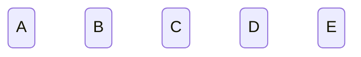
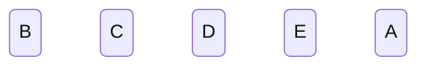
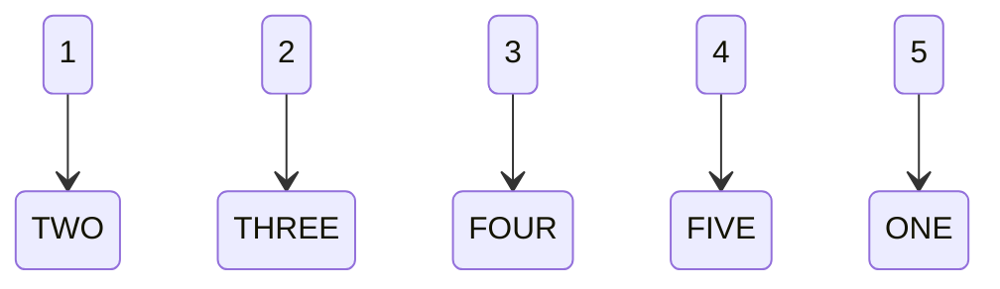

Given an array of N elements, we would like to be able to perform the following operations:
 - Shift Right
 - Shift Left 
 - Reverse


We are not restricted to in place operations, which means we're allowed to create as much "working room" as we'd like. Let's first identify these operations in more detail, or rather, let's define them. 

### Shifting 

Let us visualize a sequence of 5 elements, A through E. 



We can represent the operation of shifting by moving all of these elements one place, either left or right. Let's perform a shift left. 



Allow us to note a few basic observations:
- Shifting does not modify array length
- Shifting does not modify array order (imagine the array as a circle or loop)
- Shifting does not modify any elements. 

With these observations in mind, it is easy to note that the operation of "shifting" is equivalent to pushing every item in the array in one direction, and acounting for the overflow. Visualize this as a line of people on a board. The length of the board is the length of the array. When we want to shift left or right, we ask that everyone takes a step in either direction, and whoever falls off goes to the other side. 

Now how can we accomplish this procedurally? Let us first think of how we can "move" the elements in a list. To move elements in our array or list, we just need to observe that movement is the same as re-asigning every index of the array. We know that this movement shouldn't change, add, or remove any elements. So, one method to "move" things in our array is to create an array of the same size, and copy elements over in a different order. 

As long as we make our copy and gaurantee that one we copy every element from the original to the new array, two we only copy every element once, and three we don't copy them at the same indexes, we can gaurantee that we will "move" the elements in our array. 

Now let's combine these. We wish to move elements, without modifying the order of the elements, and with overflowing elements returning to the beginning. Let's itemize these and their implications
- Movement 
  - Utilize array copying: We will have an original array, and a copy array
  - Must copy every element: This means we must iterate over the entire array (array length)
  - Copy at different indexes: Whatever we use to iterate/index the original array must *not* be equal to what we use to index the copy
- Shifting 
  - Moves elements: We will utilize our rules above for movement within this operation
  - Accounts for overflow: We must make sure our "movement" rules work when the index number underflows or overflows

So if we represent everything with numbers instead, our operation looks like this 




To make our movement rules work when the 

To move elements one element forward or one element backwards, we can just copy them while adding or removing one from the index. We'll do the following: 
1. Create a second array the same size as `original_array`, ie `working_array`
1. Modify the first element (easier way to account for overflow is to manually implement, and then do a loop that doesn't overflow)
 - If we're shifting left, the first element becomes the last element.
 - If we're shifting right, the last element becomes the first element. 
1. Iterate over all of the elements in `original_array` (we'll use an index variable) minus one (because we manually swapped the first element)
1. Modify the index variable by adding one (move right) or subtracting one (move left). For one array we use the modified index, for the other we use the original, depending on which we're doing. 
1. return the modified array, ie `original_array`. 


So we'd get something somewhat like the following for each: 

```C#
public string[] ShiftLeft(string[] data) 
{
    var array = new string[data.Length]; // Create new array of same size as original 

    var firstElement = data[0]; // Retrieve the first value of the array 

    for ( var i = 0; i < data.Length - 1; i++) {
        // We're iterating the whole array, BUT because we're manually handling the first element we remove an iteration from the loop
        
        array[i] = data[i + 1]; // Because we are trying to write leftward, we want to start at 0. Thus we'll modify the index to the original 

    }

    array[data.Length-1] = firstElement;

    return array
}
```

```C#
public string[] ShiftRight(string[] data) 
{
    var array = new string[data.Length]; // Create new array of same size as original 

    var lastElement = data[data.Length-1]; // Retrieve the first value of the array 

    for ( var i = 0; i < data.Length - 1; i++) {
        // We're iterating the whole array, BUT because we're manually handling the first element we remove an iteration from the loop
        
        array[i + 1] = data[i]; // Because we are trying to write rightward we want to start at one greater than the first index (0) so we modify the index of array.
                    // This is equivalent to subtracting one and starting as i=1, or subtracting 1 and accounting for overflow. 

    }
 
    array[0] = lastElement;

    return array;
}
```


### Reversing 

The problem of reversing an array can again be viewed in the context of moving, however we move each element to the opposite end of the array. We can do this again by iterating, but use our index to move us further from the end of the array rather than further from the start of the array. 

Typically one would move from the start by adding to 0. We can move from the end by subtracting from the array length. This can thus be achieved rather simply. 

```C#

public string[] reverse(string[] data)
{
    var array = new string[data.Length]; // Create new array of same size as original 
    
    for (var i = 1; i<= data.Length; i++) {
        // We insert at i-1 to account for us starting at i=1 instead of i=0
        // We index at data.Length - i so that as i grows, we move further from it leftward (towards 0, the array start)
        // We set i = 1 so that subtraction always moves us (anything minus 0 is that thing, additive identity)
        // We use <= to account for starting at i=1 instead of i=0
        array[i-1] = data[data.Length - i];
    }

return array;
}

```
